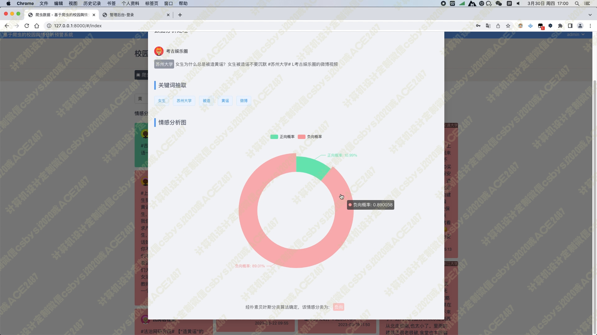

# 028 基于贝叶斯算法的校园舆情分析系统-设计展示

> **代码有偿获取 可接受定制 微信联系方式: csbysj2020 或 ACE2487，备注(BS)**

> 

> 

## 介绍

校园舆情分析预警系统，旨在帮助用户及时了解各所大学近期的舆情动态，方便用户快速了解学校形象的好坏，并及时进行舆情干预。为了实现这一目标，我们采用了Python编程语言作为后端语言，Django框架作为后端框架，使用Scrapy框架进行数据爬取，采用朴素贝叶斯情感分类算法对数据进行处理。
在前端技术上，我们采用JavaScript编程语言，Vue前端框架，Element-Plus组件库，axios请求库，windicss样式库以及Echarts可视化进行开发，实现了微博各所大学数据的展示与筛选查询、舆情分析模块以及舆情预警模块等多个功能。其中，微博各所大学数据的展示采用了瀑布流卡片形式，正向情感的文本用绿色背景，中性用灰色背景，负向以红色背景显示，方便用户一眼可以识别出该微博数据的情感倾向。当用户点击卡片时，弹出对话框，显示该微博数据的详细信息，以及信息的关键词，以及饼图分析正负向的情感概率占比。
该系统的舆情分析模块用饼图对数据库中所有的微博信息的情感占比进行分析，用柱状图对数据库中所有高校信息量进行top10排序分析，以及用词云图分析所有数据的关键词。在舆情预警模块中，我们列出了各所大学近期的舆情情况，舆情的好坏将以绿色背景或红色背景显示，点击某所大学的时候，可以以线图形式分析出近期该所大学的正负情感的走向，当某天负向情感数量大于正向情感时，将该大学舆情状况标注为坏，用红色背景显示，否则以绿色显示。
最后，通过对该系统进行详细的设计、实现与测试，我们验证了该系统的有效性与可行性，该系统不仅可以帮助用户及时了解各所大学的舆情动态，还可以提供给相关部门作为决策参考，有着极大的应用价值和发展前景。

## 技术栈

1. python编程语言，Django后端框架，Scrapy爬虫框架
2. javascript编程语言，Vue前端框架，Element-plus组件库，axios请求库，windicss样式库，echarts可视化
3. 核心算法：朴素贝叶斯情感分类，当爬虫抓取数据进行入库时，会对文本进行分析，分类出正向/中性/负向三种类别的情感，并给出正向情感的概率
4. 功能模块包括：
  a. 微博各所大学数据的展示与筛选查询，数据以瀑布流卡片形式展现，正向情感的文本用绿色背景，中性用灰色背景，负向以红色背景，方便用户一眼可以识别出该微博数据的情感倾向；
  当用户点击卡片时，弹出对话框，显示该微博数据的详细信息，以及信息的关键词，以及饼图分析正负向的情感概率占比
  b. 舆情分析模块，用饼图对数据库中所有的微博信息的情感占比进行分析，用柱状图对数据库中所有高校信息量进行top10排序分析，以及用词云图分析所有数据的关键词
  c. 舆情预警模块，列出了各所大学近期的舆情情况，舆情的好坏将以绿色背景或红色背景显示，点击某所大学的时候，可以以线图形式分析出近期该所大学的正负情感的走向，当某天负向情感数量大于正向情感时，将该大学舆情状况标注为坏，用红色背景显示，否则以绿色显示

## 视频

> **点击查看 \>\>\> [https://www.bilibili.com/video/BV1xh4y1J7kx/](https://www.bilibili.com/video/BV1xh4y1J7kx/)**

## 截图

